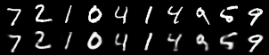
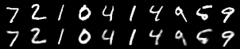
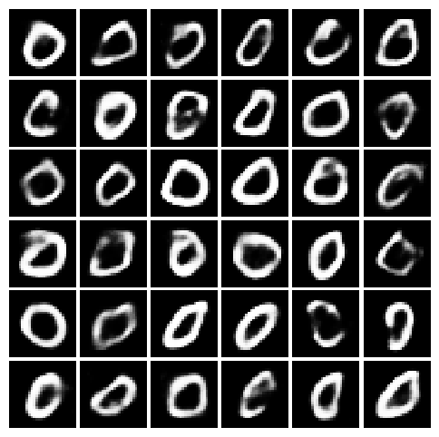
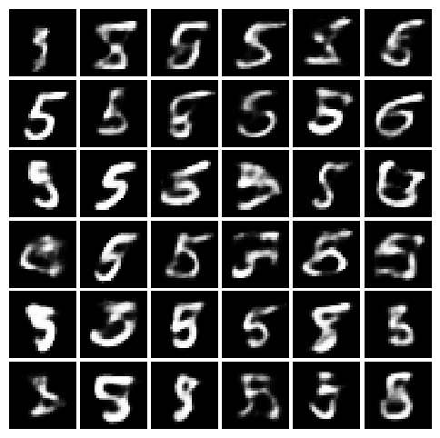
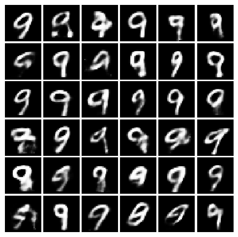

# CVAE_pytorch

This is a pytorch implemenation of CVAE on MNIST dataset. 
It also provides reconstruction of images during test time and also new image generation.

# Run
To run the program 
```
python cvae_implementaion.py
```
you can also control several paramenters of this program as well 

```
python cvae_implementaion.py --lr=0.001 --batch_size=64 --itr=40 --latent_dim=40
```

# Image Reconstruction

Below is an example of image reconstruction after 10 and 40 epochs. The top section represents the original
image and the bottom part is of the reconstructed images.

|  |  |
|--------------------------------------|--------------------------------------|
|Reconstruction after 10 Epochs        |Reconstruction after 40 Epochs        |

# Image Generation
Using CVAE we can also generate images. 
|  |  | |
|--------------------------------------|--------------------------------------|--------------------------------------|
